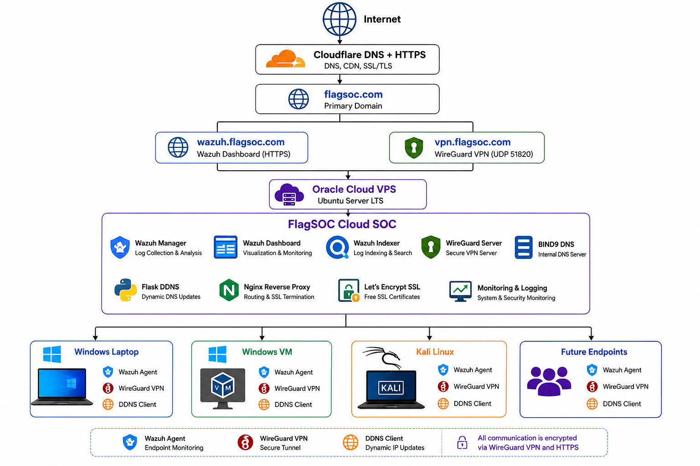
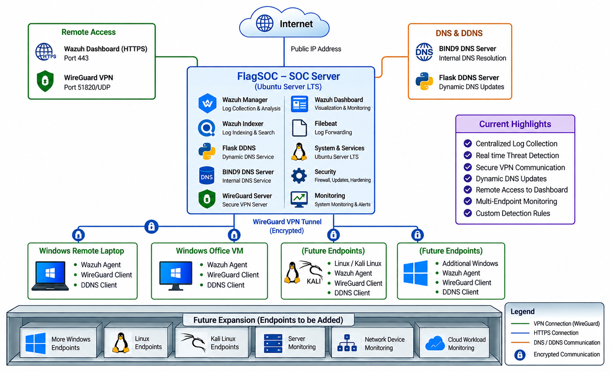

# FlagSOC — Security Operations Center Lab

## Overview

FlagSOC is a practical Security Operations Center (SOC) lab built to gain hands-on experience in centralized security monitoring, endpoint telemetry, detection engineering, alert analysis, and security investigation.

The project uses Wazuh as the core SIEM/XDR platform and integrates Windows and Linux environments for security monitoring. Windows endpoint telemetry is enhanced using Sysmon, while WireGuard provides secure network connectivity between monitored endpoints and the SOC infrastructure.

## Objectives

- Centralized security monitoring
- Windows and Linux endpoint monitoring
- Security event collection and analysis
- Detection engineering
- Alert validation
- Security investigation
- Practical SOC analyst workflow
- Endpoint telemetry analysis

## Architecture

### FlagSOC System Architecture



### Network Architecture



## Technologies

- Wazuh SIEM/XDR
- Wazuh Manager
- Wazuh Indexer
- Wazuh Dashboard
- Sysmon
- Windows
- Ubuntu Linux
- Kali Linux
- WireGuard VPN
- BIND9 DNS
- Flask DDNS
- Nginx
- Cloudflare
- Oracle Cloud
- Wireshark
- Python

## Detection Engineering

Three custom Wazuh detections were developed and validated during the project.

| Detection ID | Detection | Wazuh Rule | MITRE ATT&CK |
|---|---|---:|---|
| FLAGSOC-DET-001 | Windows Local Brute Force | 100100 | T1110 |
| FLAGSOC-DET-002 | Successful Login After Brute Force | 100101 | T1110, T1078 |
| FLAGSOC-DET-003 | SSH Brute Force | 100102 | T1110.001 |

The custom detections are available in the `detections/` directory.

## Practical Security Validations

| # | Practical | Wazuh Detection |
|---:|---|---|
| 1 | Windows Failed Authentication | 60122 |
| 2 | Windows Brute Force | 100100 |
| 3 | Successful Login After Brute Force | 100101 |
| 4 | SSH Authentication Failure | 5503 |
| 5 | SSH Brute Force | 100102 |
| 6 | Administrator Group Change | 60154 |
| 7 | Scheduled Task Creation | 60228 |
| 8 | PowerShell Process Detection | 92027 |
| 9 | File Creation Detection | 92207 |

Detailed information for each practical is available under `practicals/`.

## SOC Workflow

```text
Endpoint Activity
       ↓
Wazuh Agent
       ↓
Secure Network / WireGuard
       ↓
Wazuh Manager
       ↓
Detection Rules
       ↓
Event Correlation
       ↓
Alert Generation
       ↓
Wazuh Indexer
       ↓
Wazuh Dashboard
       ↓
Analyst Investigation
       ↓
Validation and Documentation


